# 受信信号生成ライブラリ 基本設計書

## 1. 目的

本ライブラリは、音場と受波器を定義し、受波器アレイで観測される多チャンネル受信信号を生成することを目的とする。

本ライブラリは、STFT、ビームフォーミング、検出処理、可視化処理そのものを扱う信号処理フレームワークではない。後段の信号処理に入力する受信信号を模擬生成するためのライブラリである。

本ライブラリと後段処理の境界は以下とする。

```text
SceneRenderer
  Scene + Receiver -> x[ch, t]

SPFW
  x[ch, t] -> STFT -> Beamformer -> Detector / Viewer
```

本ライブラリでは、物理的な構造を以下のように分解する。

```text
音源
 ↓
伝搬
 ↓
受波器アレイ
 ↓
受信信号
```

対応する責務は以下とする。

```text
Scene / AcousticSource / AmbientField
  音場定義

MultiChannelContributor
  多CH寄与生成の共通抽象

SourceFieldContributor
  局所音源寄与の多CH生成

AmbientFieldContributor
  背景雑音場寄与の多CH生成

SensorNoiseContributor
  センサ雑音寄与の多CH生成

SceneRenderer
  contributor 群のオーケストレーション
```

`SceneRenderer.render_components()`は、この責務分離を保ったまま各contributorの寄与を
`RenderedContribution`として保持し、その線形和を`RenderedScene.mixed`として返す。
成分分離は評価処理ではなく、生成した音響sceneの構成要素を失わずに後段へ渡すための
受信信号生成結果である。共分散推定、ビームフォーミング、BL評価は引き続き責務外とする。

局所音源と背景雑音場は`identifier`と`role`を持つ。`identifier`はscene内の物理要素を識別し、
`role`はtarget、interference、noiseなど利用側の分類を表す。roleによって生成方式を切り替えず、
音源・背景場という物理分類はcontributorの種類で保持する。

---

## 2. 最小利用イメージ

最小構成では、1つの局所音源、自由音場、1つの線形アレイ受波器を定義し、多チャンネル複素受信信号を生成する。

```python
scene = Scene(
    sources=[
        AcousticSource.from_relative_bearing(
            bearing_deg=90.0,       # 自艦右舷方向
            distance=1000.0,
            receiver_pose=receiver.trajectory.pose(0.0),
            components=[
                SourceComponent(
                    spectrum=ToneSpectrum(1000.0),
                    envelope=ConstantEnvelope(),
                    amplitude=1.0,
                )
            ],
        )
    ],
    ambient_fields=[],
    environment=FreeField(c=1500.0),
)

receiver = Receiver(
    trajectory=StaticPose(
        position_world=[0.0, 0.0, 0.0],
        heading_deg=0.0,  # 艦首は北向き
    ),
    array=LinearArray(n_ch=32, spacing=0.075),  # 既定では ArrayFrame の X 軸上に配置
)

axis_t = np.arange(32768) / 32768

x = SceneRenderer().render(scene, receiver, axis_t)

assert x.shape == (32, 32768)
```

`x` は以下の形状を持つ多チャンネル受信信号である。

```python
x.shape == (n_ch, n_sample)
```

---

## 3. 全体処理フロー

内部処理は概念的に以下の寄与加算とする。

```text
Scene
 ├─ SourceFieldContributor  ─┐
 ├─ AmbientFieldContributor ─┼─> x[ch, t]
 └─ SensorNoiseContributor ──┘
```

`SceneRenderer` は公開APIとしての入口であり、内部で contributor 群に処理を委譲する。

`SceneRenderer` 自身に、音源生成、伝搬、アレイ投影、環境雑音生成、センサ雑音生成の詳細実装を集中させない。

最小構成では、以下の contributor 群をオーケストレーションする。

```text
SourceFieldContributor
AmbientFieldContributor
SensorNoiseContributor
```

---

## 4. 座標系の設計

本ライブラリでは、音源位置とアレイ素子位置の座標系を明確に分離する。

音源や受波器の位置は、原則として絶対座標系で表す。一方、アレイ素子配置は、受波器または艦体に固定された相対座標系で表す。

この設計により、音源は絶対方位・絶対位置で定義しつつ、アレイ投影および信号処理では艦首基準の相対方位として扱うことができる。

---

### 4.1 WorldFrame

`WorldFrame` は絶対座標系である。

```text
X軸正方向 = 東
Y軸正方向 = 北
Z軸正方向 = 鉛直上方向
```

音源位置、受波器位置、伝搬方向は基本的に `WorldFrame` で表す。

例：

```python
source_pos_world
receiver_pos_world
direction_world
```

---

### 4.2 ArrayFrame

`ArrayFrame` は受波器または艦体に固定された相対座標系である。

```text
X軸正方向 = 艦首方向
Y軸正方向 = 右舷方向
Z軸正方向 = 鉛直上方向
```

アレイ素子位置は `ArrayFrame` で表す。

例：

```python
element_pos_array
direction_array
```

---

### 4.3 Frame という語の扱い

本設計における `WorldFrame` および `ArrayFrame` の `Frame` は、座標系または座標フレームを意味する。

一方、STFT における `frame` は、時間方向の処理単位を意味する。

混同を避けるため、座標系を表す場合は原則として以下のように修飾付きで表記する。

```text
WorldFrame
ArrayFrame
```

単独の `Frame` というクラス名や変数名は極力使用しない。

---

## 5. Pose の設計

`Pose` は、`WorldFrame` 上における位置と姿勢を表す。

```text
Pose = position_world + heading + pitch + roll
```

最小構成では `heading_deg` のみを使用する。`pitch_deg` と `roll_deg` は将来拡張用として保持してもよいが、最初の実装では回転計算に含めなくてよい。

```python
@dataclass
class Pose:
    position_world: np.ndarray
    heading_deg: float = 0.0
    pitch_deg: float = 0.0
    roll_deg: float = 0.0
```

`heading_deg` は航法系の方位角とする。

```text
0 deg   = 北
90 deg  = 東
180 deg = 南
270 deg = 西
```

---

## 6. 座標変換の設計

### 6.1 ArrayFrame から WorldFrame への回転

WorldFrame は以下で定義される。

```text
X = 東
Y = 北
Z = 上
```

ArrayFrame は以下で定義される。

```text
X = 艦首
Y = 右舷
Z = 上
```

艦首方位 `heading_deg` から、ArrayFrame の各軸を WorldFrame 上の単位ベクトルとして表す。

```python
def rotation_array_to_world_from_heading(heading_deg: float) -> np.ndarray:
    h = np.deg2rad(heading_deg)

    x_axis_world = np.array([np.sin(h),  np.cos(h), 0.0])  # 艦首方向
    y_axis_world = np.array([np.cos(h), -np.sin(h), 0.0])  # 右舷方向
    z_axis_world = np.array([0.0,        0.0,       1.0])  # 上方向

    return np.column_stack([
        x_axis_world,
        y_axis_world,
        z_axis_world,
    ])
```

この行列は、ArrayFrame のベクトルを WorldFrame に変換する。

```python
v_world = R_array_to_world @ v_array
```

回転行列であるため、逆変換は転置で表せる。

```python
R_world_to_array = R_array_to_world.T
v_array = R_world_to_array @ v_world
```

---

### 6.2 伝搬方向の変換

`PropagationModel` は、音源から受波器までの伝搬方向を `WorldFrame` で計算する。

```python
direction_world = (source_pos_world - receiver_pos_world) / distance
```

`ArrayProjector` は、受波器の `Pose` を用いて、`direction_world` を `direction_array` に変換する。

```python
direction_array = R_world_to_array @ direction_world
```

その後、アレイ素子位置との内積により CH 間遅延を計算する。

```text
arrival_delay_m = -r_m_array · direction_array / c
```

周波数領域では、CH ごとの位相差は以下で表す。

```text
X_m(f) = S(f) exp(-j 2π f arrival_delay_m)
```

---

## 7. 音源位置の指定方法

音源位置は、内部的には `WorldFrame` 上の `position_world` として保持する。

ただし、シミュレーション条件を記述しやすくするため、音源生成時には以下の指定方法をサポートする。

```text
1. WorldFrame 上の直交座標指定
2. WorldFrame 上の絶対方位 + 距離指定
3. Receiver / ArrayFrame 基準の相対方位 + 距離指定
```

これにより、ユーザーはシミュレーション条件を直感的に記述でき、内部処理は `WorldFrame` 上の座標表現に統一できる。

---

### 7.1 直交座標指定

直交座標指定では、音源位置を `WorldFrame` の座標値として直接指定する。

```python
source = AcousticSource.from_position(
    position_world=[1000.0, 0.0, 0.0],
    components=[component],
)
```

この例では、音源は自艦から東方向 1000 m の位置に置かれる。

---

### 7.2 絶対方位 + 距離指定

絶対方位は `WorldFrame` の水平面方位とし、以下で定義する。

```text
0 deg   = 北
90 deg  = 東
180 deg = 南
270 deg = 西
```

仰角 `elevation_deg` を含める場合、絶対方位から WorldFrame 上の単位方向ベクトルを以下で表す。

```python
def unit_vector_from_absolute_bearing(
    bearing_deg: float,
    elevation_deg: float = 0.0,
) -> np.ndarray:
    az = np.deg2rad(bearing_deg)
    el = np.deg2rad(elevation_deg)

    return np.array([
        np.cos(el) * np.sin(az),  # East
        np.cos(el) * np.cos(az),  # North
        np.sin(el),               # Up
    ])
```

音源位置は以下で求める。

```python
position_world = receiver_pose.position_world + distance * direction_world
```

利用例：

```python
source = AcousticSource.from_absolute_bearing(
    bearing_deg=90.0,
    distance=1000.0,
    receiver_pose=receiver_pose,
    components=[component],
)
```

この例では、音源は絶対方位で東方向 1000 m に置かれる。

---

### 7.3 相対方位 + 距離指定

相対方位は、受波器に固定された `ArrayFrame` の水平面方位とし、以下で定義する。

```text
0 deg   = 艦首方向
90 deg  = 右舷方向
180 deg = 艦尾方向
270 deg = 左舷方向
```

仰角 `elevation_deg` を含める場合、相対方位から ArrayFrame 上の単位方向ベクトルを以下で表す。

```python
def unit_vector_from_relative_bearing(
    bearing_deg: float,
    elevation_deg: float = 0.0,
) -> np.ndarray:
    az = np.deg2rad(bearing_deg)
    el = np.deg2rad(elevation_deg)

    return np.array([
        np.cos(el) * np.cos(az),  # Bow
        np.cos(el) * np.sin(az),  # Starboard
        np.sin(el),               # Up
    ])
```

相対方位指定では、まず `ArrayFrame` 上の方向ベクトル `direction_array` を生成し、Receiver の `Pose` を用いて `WorldFrame` 上の方向ベクトル `direction_world` へ変換する。

```python
direction_world = R_array_to_world @ direction_array
position_world = receiver_pose.position_world + distance * direction_world
```

利用例：

```python
source = AcousticSource.from_relative_bearing(
    bearing_deg=90.0,
    distance=1000.0,
    receiver_pose=receiver_pose,
    components=[component],
)
```

この例では、音源は自艦右舷方向 1000 m に置かれる。

---

### 7.4 音源指定API

`AcousticSource` の基本責務は、位置指定方法に依存しない。

内部的には、いずれの指定方法でも `StaticPosition` または `Trajectory` に変換して保持する。

```python
@dataclass
class AcousticSource:
    trajectory: Trajectory
    components: list[SourceComponent]

    @classmethod
    def from_position(
        cls,
        position_world: np.ndarray,
        components: list[SourceComponent],
    ) -> "AcousticSource":
        ...

    @classmethod
    def from_absolute_bearing(
        cls,
        bearing_deg: float,
        distance: float,
        receiver_pose: Pose,
        components: list[SourceComponent],
        elevation_deg: float = 0.0,
    ) -> "AcousticSource":
        ...

    @classmethod
    def from_relative_bearing(
        cls,
        bearing_deg: float,
        distance: float,
        receiver_pose: Pose,
        components: list[SourceComponent],
        elevation_deg: float = 0.0,
    ) -> "AcousticSource":
        ...
```

---

## 8. 主要クラスのインターフェース思想

### 8.1 Scene

`Scene` は音場の定義を保持する。

```python
Scene(
    sources: list[AcousticSource],
    ambient_fields: list[AmbientField],
    environment: Environment,
)
```

責務は以下に限定する。

```text
局所音源の集合を保持する
非局所的な背景雑音場を保持する
伝搬環境を保持する
信号生成処理そのものは持たない
```

---

### 8.2 AcousticSource

`AcousticSource` は、空間上に局所化された音源を表す。

```python
AcousticSource(
    trajectory: Trajectory,
    components: list[SourceComponent],
)
```

責務は以下とする。

```text
音源位置または移動軌跡を持つ
複数の信号成分を持つ
アレイや受波器の情報は知らない
```

音源位置の指定方法として、直交座標、絶対方位 + 距離、相対方位 + 距離をサポートする。ただし、内部表現は `Trajectory` に統一する。

---

### 8.3 SourceComponent

`SourceComponent` は、音源を構成する1つの信号成分を表す。

```python
SourceComponent(
    spectrum: Spectrum,
    envelope: Envelope,
    amplitude: float = 1.0,
    level_db: float | None = None,
)
```

`amplitude` を主指定とし、上位APIまたは利用側で source level を意図した振幅へ変換して与える前提とする。

`level_db` は簡便指定または互換用の補助引数として扱い、内部では最終的に振幅へ解決してから `SourceRenderer` に渡す。

`amplitude` と `level_db` の同時指定は許可しない。

責務は以下とする。

```text
周波数特性を持つ
時間包絡を持つ
音源位置や受波器情報は知らない
```

---

### 8.4 Spectrum

`Spectrum` は信号成分の周波数特性を表す。

```python
class Spectrum:
    def evaluate(self, freq_axis: np.ndarray) -> np.ndarray:
        ...
```

派生例：

```text
ToneSpectrum
WhiteNoiseSpectrum
BandNoiseSpectrum
GaussianSpectrum
CustomSpectrum
```

---

### 8.5 Envelope

`Envelope` は信号成分の時間包絡を表す。

```python
class Envelope:
    def evaluate(self, axis: np.ndarray) -> np.ndarray:
        ...
```

派生例：

```text
ConstantEnvelope
PulseEnvelope
FadeEnvelope
CustomEnvelope
```

---

### 8.6 AmbientField

`AmbientField` は、単一の位置や方位を持たない背景雑音場を表す。

```python
AmbientField(
    spectrum: Spectrum,
    amplitude: float = 0.0,
    covariance: np.ndarray | None = None,
    spatial_model: SpatialModel | None = None,
)
```

`spectrum` はインターフェース整合のため最小構成でも保持する。

最小構成では、`amplitude` と `covariance` を使って CH 間相関を持つ実数雑音場を生成する。

`covariance` は CH 間相関構造を表す `(n_ch, n_ch)` 行列とする。

最小構成では、非対称な `covariance` はユーザの API 使用上のエラーとして `ValueError` とする。

非正定値行列はユーザの API 使用上のエラーとして `ValueError` とする。

`spatial_model` は将来拡張用として残し、等方性雑音場などの物理モデルから `covariance` を導く際に用いる。

責務は以下とする。

```text
風浪雑音、海流雑音、等方性雑音場などを表す
単一の AcousticSource としては扱わない
CH間相関を持ちうる
アレイ形状に依存した具体的な多CH信号生成は AmbientFieldRenderer に委譲する
```

派生例：

```text
DiffuseNoiseField
WindWaveNoiseField
CurrentNoiseField
RainNoiseField
CustomCovarianceField
```

---

### 8.7 Environment

`Environment` は伝搬環境を表す。

```python
Environment(
    c: float,
)
```

最小構成では音速 `c` のみを持つ。

派生例：

```text
FreeField
ReflectiveEnvironment
LayeredOceanEnvironment
CustomEnvironment
```

---

### 8.8 Trajectory

`Trajectory` は、位置および姿勢を時間の関数として表す。

```python
class Trajectory:
    def pose(self, t: float) -> Pose:
        ...

    def position(self, t: float) -> np.ndarray:
        return self.pose(t).position_world

    def velocity(self, t: float) -> np.ndarray:
        ...
```

固定位置・固定姿勢は `StaticPose` で表す。

```python
StaticPose(
    position_world: np.ndarray,
    heading_deg: float = 0.0,
    pitch_deg: float = 0.0,
    roll_deg: float = 0.0,
)
```

音源のように姿勢を使わない対象については、`StaticPosition` を使ってよい。

---

### 8.9 Receiver

`Receiver` は受波器側の定義を保持する。

```python
Receiver(
    trajectory: Trajectory,
    array: ArrayGeometry,
)
```

責務は以下とする。

```text
受波器の位置と姿勢を持つ
アレイ形状を持つ
信号処理は行わない
```

---

### 8.10 ArrayGeometry

`ArrayGeometry` はアレイ素子の配置を表す。

```python
class ArrayGeometry:
    def positions(self) -> np.ndarray:
        ...
```

`positions()` は `ArrayFrame` 上の素子位置を返す。

```python
positions.shape == (n_ch, 3)
```

`LinearArray` の最小構成における既定配置軸は `ArrayFrame` の X 軸とする。

```text
axis = 0 = 艦首方向
axis = 1 = 右舷方向
axis = 2 = 上方向
```

派生例：

```text
LinearArray
PlanarArray
CircularArray
CustomArray
```

---

### 8.11 SceneRenderer

`SceneRenderer` は公開APIであり、`Scene` と `Receiver` から受信信号を生成する。

```python
class SceneRenderer:
    def __init__(
        self,
        contributors: list[MultiChannelContributor] | None = None,
    ) -> None:
        ...

    def render(
        self,
        scene: Scene,
        receiver: Receiver,
        axis_t: np.ndarray,
    ) -> np.ndarray:
        ...
```

責務は以下とする。

```text
全体処理のオーケストレーション
axis_t の検証
fs の内部導出
MultiChannelContributor 群への委譲
```

`axis_t` は利用側が生成して渡す時間軸とする。

最小構成では、`axis_t` に対して以下を要求する。

```text
1-D array である
厳密単調増加である
等間隔サンプリングである
```

これらを満たさない場合は、最小構成では `ValueError` とする。空配列の `axis_t` もユーザの API 使用上のエラーとして `ValueError` とする。

サンプリング周波数 `fs` は公開APIでは明示引数にせず、`SceneRenderer` が `axis_t` から内部導出して contributor 群へ渡す。

`contributors=None` の場合は、以下の既定構成を内部で生成する。

```text
SourceFieldContributor()
AmbientFieldContributor()
SensorNoiseContributor()
```

---

### 8.12 MultiChannelContributor

`MultiChannelContributor` は、受信信号への多CH寄与を生成する共通抽象である。

```python
class MultiChannelContributor:
    def render(
        self,
        scene: Scene,
        receiver: Receiver,
        axis_t: np.ndarray,
        fs: float,
    ) -> np.ndarray:
        ...
```

入力には `Scene` 全体を渡す。

最小構成では、以下の contributor を用いる。

```text
SourceFieldContributor
AmbientFieldContributor
SensorNoiseContributor
```

---

### 8.13 SourceFieldContributor

`SourceFieldContributor` は、局所音源による多CH寄与を生成する。

```python
class SourceFieldContributor(MultiChannelContributor):
    def __init__(
        self,
        source_renderer: SourceRenderer | None = None,
        propagation_model: PropagationModel | None = None,
        projector_factory: ProjectorFactory | None = None,
        array_projector: ArrayProjector | None = None,
    ) -> None:
        ...

    def render(
        self,
        scene: Scene,
        receiver: Receiver,
        axis_t: np.ndarray,
        fs: float,
    ) -> np.ndarray:
        ...
```

内部では以下を用いる。

```text
SourceRenderer
PropagationModel
ProjectorFactory
ArrayProjector
```

各引数が `None` の場合は、以下の既定構成を内部で生成する。

```text
SourceRenderer()
FreeFieldPropagation()
ProjectorFactory()
ArrayProjector()
```

最小構成での処理フローは以下とする。

```text
1. SourceRenderer で rendered_sources を生成する
2. PropagationModel で propagated_sources を生成する
3. propagated_source ごとに ProjectorFactory.resolve(...) を呼ぶ
4. ArrayProjector で propagated_sources と projectors を対応付けて多CH化する
5. 音源寄与の和を返す
```

概念的な実装イメージは以下である。

```python
rendered_sources = source_renderer.render(scene.sources, axis_t)
propagated_sources = propagation_model.propagate(
    rendered_sources=rendered_sources,
    environment=scene.environment,
    receiver=receiver,
    axis_t=axis_t,
)
projectors = [
    projector_factory.resolve(
        source=propagated.rendered_source.source,
        receiver=receiver,
        environment=scene.environment,
    )
    for propagated in propagated_sources
]
x_source = array_projector.project(
    propagated_sources=propagated_sources,
    projectors=projectors,
    receiver=receiver,
    environment=scene.environment,
    axis_t=axis_t,
    fs=fs,
)
```

---

### 8.14 AmbientFieldContributor

`AmbientFieldContributor` は、背景雑音場による多CH寄与を生成する。

`AmbientFieldRenderer | None = None` を受け、`None` の場合は内部で `AmbientFieldRenderer()` を生成する。

内部では `AmbientFieldRenderer` を用いる。

---

### 8.15 SensorNoiseContributor

`SensorNoiseContributor` は、センサ自己雑音による多CH寄与を生成する。

`SensorNoiseGenerator | None = None` を受け、`None` の場合は内部で `SensorNoiseGenerator()` を生成する。

内部では `SensorNoiseGenerator` を用いる。

---

### 8.16 SourceRenderer

`SourceRenderer` は `AcousticSource` を音源ごとの基準信号に変換する。

```python
class SourceRenderer:
    def render(
        self,
        sources: list[AcousticSource],
        axis_t: np.ndarray,
    ) -> list[RenderedSource]:
        ...
```

`SourceRenderer` ではまだ多CH化しない。

---

### 8.17 RenderedSource

`RenderedSource` は、音源信号生成後の中間表現である。

```python
RenderedSource(
    source: AcousticSource,
    signal: np.ndarray,
)
```

`signal` は単一音源の基準信号であり、shape は以下とする。

```python
signal.shape == (n_sample,)
```


将来的に周波数領域表現が必要になった場合は、以下のような中間表現の分離を検討する。

```text
RenderedSourceTime
RenderedSourceFreq
```

---

### 8.18 PropagationModel

`PropagationModel` は、音源から受波器までの伝搬経路を生成する。

```python
class PropagationModel:
    def propagate(
        self,
        rendered_sources: list[RenderedSource],
        environment: Environment,
        receiver: Receiver,
        axis_t: np.ndarray,
    ) -> list[PropagatedSource]:
        ...
```

最小構成では、自由音場の直達波のみを扱う。

`PropagationModel` は `WorldFrame` で伝搬方向を計算する。`ArrayFrame` は意識しない。

戻り値は flat な経路列ではなく、音源ごとの経路群とする。

将来的には以下を追加する。

```text
球面拡散
吸収
海面反射
海底反射
回折
マルチパス
移動体による時間変化遅延
ドップラー
```

---

### 8.19 PropagatedSource

`PropagatedSource` は、1つの音源に対応する伝搬後の中間表現である。

```python
PropagatedSource(
    rendered_source: RenderedSource,
    paths: list[PropagationPath],
)
```

`paths` は同一音源に属する伝搬経路群である。

確認用プロットやデバッグでは、この単位で音源ごとの寄与を扱う。

---

### 8.20 PropagationPath

`PropagationPath` は、1つの伝搬経路を表す。

```python
PropagationPath(
    signal: np.ndarray,
    direction_world: np.ndarray,
    delay: float,
    gain: float,
    path_type: str,
    virtual_source_pos_world: np.ndarray,
)
```

`direction_world` は、受波器から音源を見る方向を `WorldFrame` で表した単位ベクトルである。

`virtual_source_pos_world` は、その経路を生成する等価音源の `WorldFrame` 上の位置である。

直達音では実音源位置、反射音では仮想音源位置を与える。

直達音、反射音、回折音などを同じ形式で扱う。

---

### 8.21 ProjectorFactory

`ProjectorFactory` は、音源に対応する `SourceProjector` を解決する。

```python
class ProjectorFactory:
    def resolve(
        self,
        source: AcousticSource,
        receiver: Receiver,
        environment: Environment,
    ) -> SourceProjector:
        ...
```

最小構成では、音源単位で投影器の種類を決定する。

既定動作は以下とする。

```text
ProjectorFactory が無指定の場合は、組み込みの既定規則で SourceProjector を解決する
最小構成の ToneSpectrum + ConstantEnvelope では、`NarrowbandPlaneWaveProjector` を返す
AmbientFieldRenderer は `fields=[]` のときゼロ信号を返す
SensorNoiseGenerator は既定で `amplitude=0.0` とし、ゼロ信号を返す
```

このため、最小構成の `SceneRenderer` は、既定状態のままで「狭帯域局所音源のみを含む多CH受信信号」を生成できる。

無相関雑音を加えたい場合は、`SensorNoiseGenerator(amplitude=...)` を設定することで実現する。

---

### 8.22 SourceProjector

`SourceProjector` は、1音源分の伝搬経路群をまとめてアレイ受信信号へ投影する。

```python
class SourceProjector:
    def project(
        self,
        paths: list[PropagationPath],
        receiver: Receiver,
        environment: Environment,
        axis_t: np.ndarray,
        fs: float,
    ) -> np.ndarray:
        ...
```

経路間の干渉や将来のマルチパス合成を見据え、`PropagationPath` を1本ずつではなく、音源単位の経路群として受け取る。

`SourceProjector` は、各 `PropagationPath` の `virtual_source_pos_world` を使って投影を行う。

最小構成の具象実装は `NarrowbandPlaneWaveProjector` とする。

`NarrowbandPlaneWaveProjector` は、各 `path` を平面波近似で個別に投影し、その寄与を音源単位で加算する。

最小構成での返り値 dtype は `complex64` とする。必要に応じて、将来 `NarrowbandSphericalWaveProjector` などを追加する。

---

### 8.23 ArrayProjector

`ArrayProjector` は、音源単位の伝搬経路群と投影器を対応付けて多CH信号へ投影する。

```python
class ArrayProjector:
    def project(
        self,
        propagated_sources: list[PropagatedSource],
        projectors: list[SourceProjector],
        receiver: Receiver,
        environment: Environment,
        axis_t: np.ndarray,
        fs: float,
    ) -> np.ndarray:
        ...
```

`projectors[i]` は `propagated_sources[i]` に対応するものとする。数が一致しない場合は、ユーザの API 使用上のエラーとして `ValueError` とする。

責務は以下とする。

```text
音源単位の経路群と投影器を対応付ける
各投影器を呼び出して多CH寄与を生成する
音源ごとの多CH寄与を加算する
```

各 projector の内部では、ArrayFrame 上の素子位置と到来方向から CH 間遅延や位相差を扱う。

---

### 8.24 AmbientFieldRenderer

`AmbientFieldRenderer` は、`AmbientField` を多CH信号として生成する。

```python
class AmbientFieldRenderer:
    def __init__(
        self,
        rng: np.random.Generator | None = None,
    ) -> None:
        ...

    def render(
        self,
        fields: list[AmbientField],
        receiver: Receiver,
        axis_t: np.ndarray,
        fs: float,
    ) -> np.ndarray:
        ...
```

`AmbientField` は単一の基準信号を持たないため、アレイ形状と空間相関モデルを使って直接多CH信号を生成する。

最小構成では、`covariance` 行列から相関実数白色雑音を生成する。

概念的には、独立実数白色ガウス雑音 `w` に対して、`covariance = L L^T` を満たす因子 `L` を用いて `x = amplitude * (L @ w)` を生成する。

`fields=[]` のときゼロ信号を返す。

---

### 8.25 SensorNoiseGenerator

`SensorNoiseGenerator` は、センサ自己雑音やADC雑音など、CH間無相関または受波器固有の雑音を生成する。

```python
class SensorNoiseGenerator:
    def __init__(
        self,
        amplitude: float | np.ndarray = 0.0,
        rng: np.random.Generator | None = None,
    ) -> None:
        ...

    def generate(
        self,
        receiver: Receiver,
        axis_t: np.ndarray,
        fs: float,
    ) -> np.ndarray:
        ...
```

これは `Scene` ではなく `Receiver` 側の現象として扱う。

最小構成では、各 CH 独立な実数白色ガウス雑音を生成する。

`amplitude` を主指定とし、各 CH 雑音の標準偏差として扱う。

`amplitude` は全 CH 共通の `float`、または CH ごとの `(n_ch,)` 配列を許す。

内部で `level_db` 変換や `sqrt(fs / 2)` のような追加スケーリングは行わない。

`fs` はインターフェース整合のために受けるが、最小構成では雑音振幅換算には使わない。

`amplitude=0.0` の場合はゼロ信号を返す。

---

## 9. ファイル構成

最初は、意味のまとまりごとに1ファイルとする。

```text
scene_renderer/
├── __init__.py
├── scene/
│   ├── __init__.py
│   ├── scene.py
│   ├── source.py
│   ├── ambient.py
│   ├── environment.py
│   ├── spectrum.py
│   ├── envelope.py
│   └── trajectory.py
├── receiver/
│   ├── __init__.py
│   ├── receiver.py
│   └── array.py
└── renderer/
    ├── __init__.py
    ├── scene_renderer.py
    ├── contributor.py
    ├── source_field_contributor.py
    ├── ambient_field_contributor.py
    ├── sensor_noise_contributor.py
    ├── source_renderer.py
    ├── projector_factory.py
    ├── source_projector.py
    ├── array_projector.py
    ├── ambient_renderer.py
    ├── sensor_noise.py
    └── propagation/
        ├── __init__.py
        ├── base.py
        ├── free_field.py
        └── path.py
```

公開APIは `scene_renderer/__init__.py` で固定する。

```python
from scene_renderer.scene import (
    Scene,
    AcousticSource,
    SourceComponent,
    ToneSpectrum,
    ConstantEnvelope,
    FreeField,
    StaticPose,
    StaticPosition,
)

from scene_renderer.receiver import (
    Receiver,
    LinearArray,
)

from scene_renderer.renderer import SceneRenderer
```

内部構成を後で変更しても、利用側コードの import は極力変えない。

---

## 10. 各クラスの派生イメージ

### Source 系

```text
AcousticSource
├── PointSource
├── MovingSource
└── CompositeSource
```

ただし最初は `AcousticSource + Trajectory` で表現し、派生クラスは必要になってから追加する。

---

### Spectrum 系

```text
Spectrum
├── ToneSpectrum
├── WhiteNoiseSpectrum
├── BandNoiseSpectrum
├── GaussianSpectrum
└── CustomSpectrum
```

派生が増えた場合は以下のように分割する。

```text
scene/
└── spectrum/
    ├── base.py
    ├── tone.py
    ├── white_noise.py
    ├── band_noise.py
    └── custom.py
```

---

### Envelope 系

```text
Envelope
├── ConstantEnvelope
├── PulseEnvelope
├── FadeEnvelope
└── CustomEnvelope
```

---

### AmbientField 系

```text
AmbientField
├── DiffuseNoiseField
├── WindWaveNoiseField
├── CurrentNoiseField
├── RainNoiseField
└── CustomCovarianceField
```

---

### Environment 系

```text
Environment
├── FreeField
├── ReflectiveEnvironment
├── LayeredOceanEnvironment
└── CustomEnvironment
```

---

### Trajectory 系

```text
Trajectory
├── StaticPose
├── StaticPosition
├── LinearMotion
├── WaypointTrajectory
└── CustomTrajectory
```

---

### ArrayGeometry 系

```text
ArrayGeometry
├── LinearArray
├── PlanarArray
├── CircularArray
└── CustomArray
```

---

### PropagationModel 系

```text
PropagationModel
├── FreeFieldPropagation
├── ReflectionPropagation
├── DiffractionPropagation
├── MultipathPropagation
└── CustomPropagation
```

---

### Contributor 系

```text
MultiChannelContributor
├── SourceFieldContributor
├── AmbientFieldContributor
└── SensorNoiseContributor
```

---

### Projector 系

```text
ProjectorFactory
└── CustomProjectorFactory

SourceProjector
├── NarrowbandPlaneWaveProjector
├── NarrowbandSphericalWaveProjector
└── BroadbandProjector
```

---

## 11. クラス図

```mermaid
classDiagram
    class Scene {
      +list~AcousticSource~ sources
      +list~AmbientField~ ambient_fields
      +Environment environment
    }

    class AcousticSource {
      +Trajectory trajectory
      +list~SourceComponent~ components
      +from_position(position_world, components)
      +from_absolute_bearing(bearing_deg, distance, receiver_pose, components, elevation_deg)
      +from_relative_bearing(bearing_deg, distance, receiver_pose, components, elevation_deg)
    }

    class SourceComponent {
      +Spectrum spectrum
      +Envelope envelope
      +float amplitude
      +float level_db
    }

    class Spectrum {
      <<abstract>>
      +evaluate(freq_axis)
    }

    class ToneSpectrum {
      +float frequency
      +evaluate(freq_axis)
    }

    class Envelope {
      <<abstract>>
      +evaluate(axis)
    }

    class ConstantEnvelope {
      +evaluate(axis)
    }

    class AmbientField {
      <<abstract>>
      +Spectrum spectrum
      +float level_db
      +SpatialModel spatial_model
    }

    class Environment {
      <<abstract>>
      +float c
    }

    class FreeField {
      +float c
    }

    class Pose {
      +ndarray position_world
      +float heading_deg
      +float pitch_deg
      +float roll_deg
      +rotation_array_to_world()
      +rotation_world_to_array()
      +world_vector_to_array(v_world)
    }

    class Trajectory {
      <<abstract>>
      +pose(t)
      +position(t)
      +velocity(t)
    }

    class StaticPose {
      +ndarray position_world
      +float heading_deg
      +pose(t)
    }

    class StaticPosition {
      +ndarray position_world
      +pose(t)
    }

    class Receiver {
      +Trajectory trajectory
      +ArrayGeometry array
    }

    class ArrayGeometry {
      <<abstract>>
      +positions()
    }

    class LinearArray {
      +int n_ch
      +float spacing
      +int axis = 0
      +bool centered
      +positions()
    }

    class SceneRenderer {
      +render(scene, receiver, axis_t)
    }

    class MultiChannelContributor {
      <<abstract>>
      +render(scene, receiver, axis_t, fs)
    }

    class SourceFieldContributor {
      +render(scene, receiver, axis_t, fs)
    }

    class AmbientFieldContributor {
      +render(scene, receiver, axis_t, fs)
    }

    class SensorNoiseContributor {
      +render(scene, receiver, axis_t, fs)
    }

    class SourceRenderer {
      +render(sources, axis_t)
    }

    class RenderedSource {
      +AcousticSource source
      +ndarray signal
    }

    class PropagationModel {
      <<abstract>>
      +propagate(rendered_sources, environment, receiver, axis_t)
    }

    class FreeFieldPropagation {
      +propagate(rendered_sources, environment, receiver, axis_t)
    }

    class PropagatedSource {
      +RenderedSource rendered_source
      +list~PropagationPath~ paths
    }

    class PropagationPath {
      +ndarray signal
      +ndarray direction_world
      +float delay
      +float gain
      +string path_type
      +ndarray virtual_source_pos_world
    }

    class ProjectorFactory {
      +resolve(source, receiver, environment)
    }

    class SourceProjector {
      +project(paths, receiver, environment, axis_t, fs)
    }

    class NarrowbandPlaneWaveProjector {
      +project(paths, receiver, environment, axis_t, fs)
    }

    class ArrayProjector {
      +project(propagated_sources, projectors, receiver, environment, axis_t, fs)
    }

    class AmbientFieldRenderer {
      +render(fields, receiver, axis_t)
    }

    class SensorNoiseGenerator {
      +generate(receiver, axis_t)
    }

    Scene "1" --> "*" AcousticSource
    Scene "1" --> "*" AmbientField
    Scene "1" --> "1" Environment
    AcousticSource "1" --> "1" Trajectory
    AcousticSource "1" --> "*" SourceComponent
    SourceComponent "1" --> "1" Spectrum
    SourceComponent "1" --> "1" Envelope
    ToneSpectrum --|> Spectrum
    ConstantEnvelope --|> Envelope
    FreeField --|> Environment
    StaticPose --|> Trajectory
    StaticPosition --|> StaticPose
    StaticPose --> Pose
    Receiver "1" --> "1" Trajectory
    Receiver "1" --> "1" ArrayGeometry
    LinearArray --|> ArrayGeometry
    SceneRenderer --> MultiChannelContributor
    SourceFieldContributor --|> MultiChannelContributor
    AmbientFieldContributor --|> MultiChannelContributor
    SensorNoiseContributor --|> MultiChannelContributor
    SourceFieldContributor --> SourceRenderer
    SourceFieldContributor --> PropagationModel
    SourceFieldContributor --> ProjectorFactory
    SourceFieldContributor --> ArrayProjector
    AmbientFieldContributor --> AmbientFieldRenderer
    SensorNoiseContributor --> SensorNoiseGenerator
    SourceRenderer --> RenderedSource
    PropagationModel --> PropagatedSource
    PropagatedSource --> PropagationPath
    FreeFieldPropagation --|> PropagationModel
    NarrowbandPlaneWaveProjector --|> SourceProjector
    ProjectorFactory --> SourceProjector
    ArrayProjector --> PropagatedSource
    ArrayProjector --> SourceProjector
    AmbientFieldRenderer --> AmbientField
```



---

## 12. 最小構成で実装する範囲

最初に実装する範囲は以下とする。

```text
Scene
AcousticSource
SourceComponent

Spectrum
ToneSpectrum

Envelope
ConstantEnvelope

Environment
FreeField

Pose
Trajectory
StaticPose
StaticPosition

Receiver
ArrayGeometry
LinearArray

RenderedSource
PropagatedSource
PropagationPath

SceneRenderer
MultiChannelContributor
SourceFieldContributor
AmbientFieldContributor
SensorNoiseContributor

SourceRenderer
PropagationModel
FreeFieldPropagation
ProjectorFactory
SourceProjector
ArrayProjector

AmbientFieldRenderer
SensorNoiseGenerator
```

ただし、`AmbientFieldRenderer` と `SensorNoiseGenerator` は最小構成ではゼロ信号を返す。`AmbientFieldContributor` と `SensorNoiseContributor` はそれらの零出力実装をそのまま利用する。

---

## 13. 最小構成で扱わないもの

最小構成では以下は実装しない。

```text
WhiteNoiseSpectrum
BandNoiseSpectrum
GaussianSpectrum
CustomSpectrum

DiffuseNoiseField
WindWaveNoiseField
CurrentNoiseField
RainNoiseField
CustomCovarianceField

ReflectiveEnvironment
LayeredOceanEnvironment

LinearMotion
WaypointTrajectory

ReflectionPropagation
DiffractionPropagation
MultipathPropagation

球面拡散
吸収
絶対伝搬遅延の信号反映
ドップラー
```

ただし、後から追加できるようにインターフェースは残す。

---

## 14. 最小構成における理論モデル

### 14.1 音源信号

最小構成では、単一トーンを対象とする。

```text
s(t) = A exp(j 2π f t)
```

既定では `amplitude` を直接指定し、`A = amplitude` とする。

`level_db` を使う場合のみ、利用側または `SourceComponent` 内で以下の換算を行う。

```text
A = 10^(level_db / 20)
```

`amplitude` と `level_db` のいずれも省略した場合は `A=1.0` とする。

---

### 14.2 自由音場伝搬

最小構成では、自由音場の直達波のみを扱う。

音源位置を `source_pos_world`、受波器位置を `receiver_pos_world` とすると、

```python
diff_world = source_pos_world - receiver_pos_world
distance = norm(diff_world)
direction_world = diff_world / distance
```

伝搬遅延は以下で表す。

```text
delay = distance / c
```

ただし、最小構成では `delay` は `PropagationPath` に保持するだけで、信号には反映しない。

ゲインは最初は以下とする。

```text
gain = 1.0
```

球面拡散 `gain = 1 / distance` は将来拡張とする。

---

### 14.3 アレイ投影

`ArrayProjector` は、まず `direction_world` を `direction_array` に変換する。

```python
direction_array = receiver_pose.world_vector_to_array(direction_world)
```

ArrayFrame 上の素子位置を `r_m_array` とすると、CH ごとの遅延は以下である。

```text
arrival_delay_m = -r_m_array · direction_array / c
```

単一トーンの場合、CH ごとの信号は以下で表す。

```text
x_m(t) = gain * s(t) * exp(-j 2π f arrival_delay_m)
```

これにより、絶対座標で定義された音源を、受波器姿勢に応じた相対方位としてアレイに投影できる。

---

## 15. 検証項目

### 15.1 shape 確認

```python
assert x.shape == (n_ch, n_sample)
```

---

### 15.2 絶対方位指定の確認

条件：

```text
receiver_pos_world = [0, 0, 0]
absolute_bearing_deg = 90
距离 = 1000
```

期待値：

```text
source_pos_world = [1000, 0, 0]
```

---

### 15.3 相対方位指定の確認: heading = 0 deg

条件：

```text
receiver heading = 0 deg
relative_bearing_deg = 90 deg
距離 = 1000
```

heading = 0 deg では艦首が北、右舷が東であるため、期待値は以下となる。

```text
source_pos_world = [1000, 0, 0]
```

また、WorldFrame の東方向は ArrayFrame では右舷方向になる。

```text
direction_world = [1, 0, 0]
direction_array = [0, 1, 0]
```

---

### 15.4 相対方位指定の確認: heading = 90 deg

条件：

```text
receiver heading = 90 deg
relative_bearing_deg = 90 deg
距離 = 1000
```

heading = 90 deg では艦首が東、右舷が南であるため、期待値は以下となる。

```text
source_pos_world = [0, -1000, 0]
```

---

### 15.5 CH 間位相差確認

隣接素子間隔を `d`、到来方向を `direction_array`、アレイ軸方向を `e` とすると、隣接素子間の遅延差は以下である。

```text
arrival_delay = -d * (e · direction_array) / c
```

理論上の隣接 CH 位相差は以下となる。

```text
Δφ = -2π f arrival_delay
```

実装結果では以下が理論値と一致することを確認する。

```python
measured_phase = np.angle(x[1, 0] / x[0, 0])
```

---

## 16. 設計上の重要判断

### 16.1 内部表現は WorldFrame に統一する

音源位置は、指定方法にかかわらず、内部的には `WorldFrame` 上の `position_world` に変換して保持する。

---

### 16.2 音源指定APIは複数用意する

シミュレーション条件を記述しやすくするため、以下の指定方法をサポートする。

```text
直交座標指定
絶対方位 + 距離指定
相対方位 + 距離指定
```

---

### 16.3 PropagationModel は WorldFrame のみを扱う

`PropagationModel` はアレイ座標系を知らない。

```python
direction_world
```

のみを計算する。

---

### 16.4 ArrayProjector が WorldFrame から ArrayFrame へ変換する

`ArrayProjector` は、受波器の `Pose` を使って、以下を計算する。

```python
direction_array = R_world_to_array @ direction_world
```

その後、`element_pos_array` と内積を取り、CH 間遅延を求める。

---

### 16.5 最小構成では経路遅延と伝搬損失は信号に反映しない

最初は以下を信号に反映しない。

```text
経路遅延 delay = distance / c
伝搬損失 gain = 1 / distance
```

まずは以下を優先して検証する。

```text
CH間遅延
相対方位
heading による座標変換
方位 + 距離指定による音源配置
```

---

## 17. 次の詳細設計で詰める項目

本基本設計の次段階として、詳細設計では以下を定義する。

```text
各クラスの dataclass 定義
各メソッドの引数・戻り値
shape 規約
例外仕様
最小テスト項目
example_minimal.py
pytest による検証コード
```

特に最初に確定すべき実装上の論点は以下である。

```text
経路遅延 delay をいつ信号へ反映するか
経路ゲイン gain をいつ単純倍率から伝搬損失モデルへ拡張するか
```

`RenderedSource` および `PropagatedSource` は、当面は時間領域表現として扱う。

周波数領域表現が必要になった場合は、`RenderedSourceFreq` などの別型として追加する。
---

## 18. 既定構成規約

公開コンストラクタでは `None` を受けて既定構成を選べるようにする。

一方で、内部保持属性には `None` を残さず、初期化時に必ず具体インスタンスへ解決する。

これは、利用時の簡便さと、Pylance などの型検査における非 `None` 保証を両立するためである。

最小構成の既定インスタンス化規約は以下とする。

```text
SceneRenderer(contributors=None)
  -> [SourceFieldContributor(), AmbientFieldContributor(), SensorNoiseContributor()]

SourceFieldContributor(...=None)
  -> SourceRenderer()
  -> FreeFieldPropagation()
  -> ProjectorFactory()
  -> ArrayProjector()

AmbientFieldContributor(...=None)
  -> AmbientFieldRenderer()

SensorNoiseContributor(...=None)
  -> SensorNoiseGenerator()
```

---
## 19. shape / dtype / 例外規約

最小構成では、shape / dtype / 例外を以下で統一する。

```text
多CH信号の shape は (n_ch, n_sample)
時間軸の shape は (n_sample,)
基本の返り値 dtype は complex64
実信号であることが確定する場合の返り値 dtype は float32
```

warning 規約は以下とする。

```text
SceneRenderer(dtype=float32) 指定時に複素寄与が含まれる場合は warning を出し、最終出力では虚部を捨てる
```

例外規約は以下とする。

```text
空配列の axis_t は ValueError
単調増加でない axis_t は ValueError
等間隔でない axis_t は ValueError
非正定値の covariance は ValueError
propagated_sources と projectors の数不一致は ValueError
```


